# KeepTheBeat

# Inhaltsverzeichnis
[Arbeitsjournal	](#_toc169285371)

[Projektidee	](#_toc169285372)

[Projektbeschrieb	](#_toc169285373)

[Projektplanung	](#_toc169285374)

[Architektur und Design	](#_toc169285375)

[Datentypen	](#_toc169285376)

[Pflichtfelder	](#_toc169285377)

[PAP	](#_toc169285378)

[Mockup	](#_toc169285379)

[Prototyping	](#_toc169285380)

[Implementation	](#_toc169285381)

[Klassendiagramm	](#_toc169285382)

[Testing	](#_toc169285383)

[Architektur und Design	](#_toc169285384)

[Projektpräsentation	](#_toc169285388)

[Fazit	](#_toc169285389)

## Arbeitsjournal

|Datum |Ana|Aurel|Larissa|
| :- | :- | :- | :- |
|21\.02.2024|
14:15-15:20: Wir haben alle in der Gruppe Ideen gesammelt und uns dann gemeinsam entschieden, eine eigene Version von Spotify zu erstellen, wir haben uns gemeinsam für einen Namen entschieden und ich und Larissa haben ein Logo erstellt. 

15:20- 15:25: Arbeitsjournal für heute erstellt
|
14:15-15:20: Wir haben alle in der Gruppe Ideen gesammelt und uns dann gemeinsam entschieden, eine eigene Version von Spotify zu erstellen, wir haben uns gemeinsam für einen Namen entschieden

15:20-15:25: Arbeitsjournal für heute erstellt
|
14:15-15:20: Wir haben alle in der Gruppe Ideen gesammelt und uns dann gemeinsam entschieden, eine eigene Version von Spotify zu erstellen, wir haben uns gemeinsam für einen Namen entschieden und ich und Ana haben ein Logo erstellt. 

15:20- 15:25: Arbeitsjournal für heute erstellt
|
|26\.02.2024|
14:05-15:20: Ich habe die Planung bis zu den Ferien fertiggestellt mit Hilfe von den anderen und habe ein neues Projekt auf GitLab erstellt, die anderen eingeladen und es eingerichtet.

15:20-15:25: Arbeitsjournal für heute erstellt 
|
14:05-15:20: Wir haben gemeinsam die Planung bis zu den Ferien gemacht. Ich habe auch den Projektauftrag nochmals genau durchgelesen.

15:20-15:25: Arbeitsjournal für heute erstellt.
|
14:05-15:20: Wir haben gemeinsam die Planung bis zu den Ferien gemacht. 

15:20-15:25: Arbeitsjournal für heute erstellt
|
|04\.03.2024|
14:05-14:50: Ich habe die Funktionalität und das Ziel von unserer Applikation in der Dokumentation aufgeschrieben und die Projektidee beschrieben von unserem Projekt. Ausserdem habe ich noch die Features der Applikation beschrieben. 

14:50- 14:55: Arbeitsjournal für heute erstellt 
|
War ich krank und habe nichts gearbeitet

|
14:05-14:50: Ich habe heute das PAP erstellt.

14:50- 14:55: Arbeitsjournal für heute erstellt
|
|11\.03.2024|
14:05-15:20: Wir haben heute das Programm mit GitLab verbunden. Ausserdem habe ich alle Klassen, sowie die Membervariablen, die Vererbung und die Interfaces erstellt. Dabei habe ich mich mit den anderen zwei beraten und sie haben mir auch geholfen bei der Vererbung. Die Interfaces habe ich noch nicht implementiert 

15\.20-15:25: Arbeitsjournal für heute erstellt 
|
In der Ersten Lektion musste ich noch ein Test nachholen. 

14:50 - 15:20 Habe ich geholfen bei der GitLab Verbindung und habe angefangen mich über SQLite zu informieren.

15:20-15:25: Arbeitsjournal für heute erstellt

|
14:05-15:20: Wir haben heute das Programm mit GitLab verbunden. Zudem habe ich auch geholfen bei der Vererbung. 

15\.20-15:25: Arbeitsjournal für heute erstellt
|
|18\.03.2024|
14:05- 14:50: Ich habe zusammen mit Larissa angefangen, das Login zu erstellen. Dabei haben wir uns zuerst Gedanken dazu gemacht, wie es aussehen soll und wie wir es machen wollen mit dem Registrieren. Wir haben uns dann entschieden, dass wir es mit Hilfe eines Dropdowns machen werden. Wir haben dann angefangen, die einzelnen Felder zu erstellen. 

14:50- 14:55: Arbeitsjournal für heute erstellt 
|
14:05-14:50 Ich habe mich über Sqlite Datenbanken informiert und nachgelesen wie man Skripte zum Erstellen von Datenbanken und Tabellen erstellt. Ich habe dann auch die notwendigen NuGet-Pakete heruntergeladen. 

14:50-14.55 Arbeitsjournal für heute erstellt.

|
14:05- 14:50: Ich habe zusammen mit Ana angefangen, das Login zu erstellen. Dabei haben wir uns zuerst Gedanken dazu gemacht, wie es aussehen soll und wie wir es machen wollen mit dem Registrieren.

14:50- 14:55: Arbeitsjournal für heute erstellt
|
|25\.03.2024|
14:05-15:20: Wir haben heute zusammen besprochen, was wir in den Ferien noch fertigstellen wollen. Ich und Larissa haben weiter an dem Login gearbeitet, haben alle Felder erstellt und beschriftet. 

15:20-15:25: Arbeitsjournal für heute erstellt 
|
14:05-15:20: Wir haben heute zusammen besprochen, was wir in den Ferien noch fertigstellen wollen. Ich habe mich weiter über Sqlite Datenbanken informiert und nachgelesen wie man Skripte zum Erstellen von Datenbanken und Tabellen erstellt. Ich habe dann auch die notwendigen NuGet-Pakete heruntergeladen. 

14:50-14.55 Arbeitsjournal für heute erstellt.

|
14:05-15:20: Wir haben heute zusammen besprochen, was wir in den Ferien noch fertigstellen wollen. Ich und Ana haben weiter an dem Login gearbeitet, haben alle Felder erstellt und beschriftet. 

15:20-15:25: Arbeitsjournal für heute erstellt
|
|08\.04.2024||
In den Ferien: 

Da es nicht mit Blazer geht, musste ich ein Wpf Programm machen. Da musste ich zuerst noch die Pages von Blazor umwandeln, so dass ich sie im Wpf benutzen kann. Dann habe ich an der Datenbank gearbeitet. Ich habe zuerst ein Skript erstellt welche die Datenbank erstellt mit allen Tabellen und dann noch mit den Funktionen angefangen, mit welchen man Daten in die Datenbank schreiben kann. Dabei habe ich schon AddUser, AddArtist und AddSong gemacht.
|
15:00- 16:10: Ich habe heute das Registrieren gemacht und die Pages miteinander verknüpft (Login und Register)

16:10-16:20: Arbeitsjournal für heute erstellt
|
|15\.04.2024|
14:10-15:20: Ich habe heute die Planung bis zum Abgabetermin erstellt, das Deckungsblatt erstellt sowie auch das Inhaltsverzeichnis. 

15:15-15:20: Arbeitsjournal für heute erstellt
|
14:00-15:20: Ich habe heute das Blazor Projekt auf Gitlab mit dem Wpf Projekt ausgetauscht. Und habe noch an dem Datenbank Skript gearbeitet. 

15:15-15:20: Arbeitsjournal für heute erstellt.
|
14:10-15:15: Ich habe heute das PAP überarbeitet und in die Dokumentation eingefügt

15:15-15:20 Arbeitsjournal für heute erstellt
|
|22\.04.2024|
14:10-15:00

Ich habe heute das Mockup gezeichnet.

15:00-15:05

Arbeitsjournal für heute erstellt.
|
14\.10-15:00

Ich habe heute nochmals an der Datenbank gearbeitet und habe sie mit der Registration Verbunden.

15:00-15:05 

Arbeitsjournal für heute erstellt. 
|
14:10-15:00 

Ich habe heute die Datentypen aufgelistet und die bis jetzt vorhandenen Pflichtfelder

15:00-15:05 

Arbeitsjournal für heute erstellt.
|
|29\.04.2024|
14:10-15:15 

Ich habe heute das Mockup beschrieben. 

15:15-15:20

Arbeitsjournal für heute erstellt. 

|
14:10-15:10

Ich habe mich mit Larissa über das weitere Vorgehen unterhalten. Und habe noch zur Datenbank und API-Verbindungen recherchiert.

15:10-15:20 Arbeitsjournal für heute erstellt.
|
14:10-15:10

Ich habe mich heute mit Aurel über das weitere Vorgehen unterhalten und mir Gedanken zum relationalen Modell gemacht.

15:10-15:20 Arbeitsjournal für heute erstellt.
|
|06\.05.2024|
14:10-14:55

Ich habe mich heute in WPF eingelesen, da wir uns entschieden haben, unser Projekt damit umzusetzen, weil Blazor Probleme mit SQL Lite hat. 

14:55-15:00

Arbeitsjournal für heute erstellt 
|
14:10-14:55

Ich habe Heute die Datenbank in Wpf fertiggestellt. Und den anderen geholfen mit WPF und SQL.

14:55-15:00

Arbeitsjournal für heute erstellt.

|
14:10-14:55

Ich musste heute das Projekt neu kolonen, da es gebuggt hat und mich dann in WPF einarbeiten.

14:55-15:00

Arbeitsjournal für heute erstellt.
|
|13\.05.2024|
14:05-15:20

Wir haben uns jetzt entschieden, die Applikation mit Blazor umzusetzen, da wir uns mit Blazor besser auskennen. Wir haben die ganze Zeit das Projekt umstrukturiert und die bestehenden Seiten und Klassen in das neue Projekt kopiert.  

15:20-15:25

Arbeitsjournal für heute erstellt 
|
14:05-15:20

Wir haben uns jetzt entschieden, die Applikation mit Blazor umzusetzen, da wir uns mit Blazor besser auskennen. Ich habe die Datenbank Klassen wieder so abgeändert das sie in Blazor funktionieren. Und habe den anderen dann noch geholfen.

15:20-15:25

Arbeitsjournal für heute erstellt.
|
14:05-15:20

Wir haben uns jetzt entschieden, die Applikation mit Blazor umzusetzen, da wir uns mit Blazor besser auskennen. Wir haben die ganze Zeit das Projekt umstrukturiert und die bestehenden Seiten und Klassen in das neue Projekt kopiert.  

15:20-15:25

Arbeitsjournal für heute erstellt 
|
|27\.05.2024|
14:10-15:10

Heute haben wir eine API ausgesucht und versucht, diese mit der Applikation zu verbinden, damit wir alle Daten von den Liedern in unserer Applikation haben, damit wir nicht alle separat heraussuchen müssen. 

15:10- 15:15

Arbeitsjournal für heute erstellt. 
|
14:10-15:10 

Ich habe heute an der Logik der Playlists gearbeitet, also dass man Playlists erstellen kann und dass man Songs ihnen zuweisen kann. Ich habe auch noch die Playlist Page gemacht. 

15:10-15:15

Arbeitsjournal für heute erstellt.

Die Playlist Page ist aber noch nicht ganz fertig, ich werde sie zuhause fertigstellen und dann noch eine Möglichkeit finden Songs in Blazer abspielen zu können.

|
14:10-15:10

Heute haben wir eine API ausgesucht und versucht, diese mit der Applikation zu verbinden, damit wir alle Daten von den Liedern in unserer Applikation haben, damit wir nicht alle separat heraussuchen müssen. 

15:10- 15:15

Arbeitsjournal für heute erstellt.
|
|03\.06.2024|
14:15-15:20

Ich habe heute das Mockup auf Gitlab hochgeladen und Larissa dabei geholfen die Searchingbar zu erstellen. Ausserdem habe ich noch aufgeschrieben, was wir noch alles machen müssen 

15:20-15:25

Arbeitsjournal für heute erstellt
|
14:15:20

Wir haben uns dazu entschieden anstelle mit einer Api zu arbeiten lokal gespeicherte mp3 Dateien zu verwalten. Dazu habe ich angefangen eine Page zu mache, wo man die Dateien in die Datenbank laden kann.

Zuhause machte ich die Page zum Hochladen von Songs noch fertig, zusätzlich baute ich den Musikplayer in das Programm und eine Option Feedback/Support zu bekommen mit einem integriertem E-Mail-Service. Ich habe auch die Restliche App noch angepasst und mit der Datenbank richtig verbunden.
|
14:10-15:20

Ich habe heute die Searchingbar erstellt und das PAP auf Git Lab geladen.

15:20-15:25

Arbeitsjournal für heute erstellt
|
|10\.06.2024|
14:30-14:55

Wir haben heute besprochen, welche Teilaufgaben wir übernehmen. Ausserdem habe ich die Tabelle mit den Datentypen noch ergänz und verbessert. Ausserdem habe ich das Design angepasst, sowie auch das Fazit geschrieben und das Design beschrieben 

14:55-15:00

Arbeitsjournal für heute erstellt 

|
14:30-14:55

Wir haben abgemacht, wer noch alles fertig macht. Und sind die Projektanforderungen noch durchgegangen. Ich habe dann angefangen an den Unit Testes zu arbeiten.

14:55-15:00

Arbeitsjournal für heute geschrieben.
|
14:30-14:55

Wir haben heute besprochen, welche Teilaufgaben wir übernehmen. Ausserdem habe ich das Klassendiagramm erstellt und auf Git geladen. 

14:55-15:00

Arbeitsjournal für heute erstellt 

|

## Projektidee
Wir machen eine eigene Version von Spotify (Keep the Beat), wobei man eigene Playlists erstellen kann.
## Projektbeschrieb
Unsere Applikation wird mithilfe von Blazor erstellt und enthaltet mehrere Seiten. Man kann Playlists erstellen, Songs suchen und diese zu einer Playlist hinzufügen. Ausserdem wird es ein Login enthalten, wo man sich ein Konto erstellen kann, und dieses gespeichert wird sowie auch eine Registrierungsfunktion. Alle eingegebenen Daten werden in einer Datenbank gespeichert, die mithilfe von SQL Lite erstellt wird. Das Ziel der Applikation ist es, dass man mithilfe dieser Applikation seine Lieblingslieder schnell und einfach finden kann und man sich organisieren kann. 
## Projektplanung

|Datum |Aufgaben |
| :- | :- |
|21\.02.2024 |Idee finden, Logo erstellen, Name finden, Arbeitsjournal erstellen |
|26\.02.2024 |Planung fertigstellen bis zu den Ferien, Gitlab einrichten, Arbeitsjournal erstellen|
|04\.03.2024|PAP erstellen, Funktionalität beschreiben, Ziel der Applikation definieren, Features definieren, Arbeitsjournal erstellen|
|11\.03.2024|
Mit Git verbinden 

Klassen definieren, Membervariablen definieren, Vererbung definieren, Interface definieren, Arbeitsjournal erstellen
|
|18\.03.2024|Datenbank einrichten, Login erstellen, Arbeitsjournal erstellen|
|25\.03.2024|
Datenbank einrichten, mit Login weiterfahren 

- In den Ferien fertigstellen, Arbeitsjournal erstellen
|
|15\.04.2024 |Planung bis zum Abgabetermin fertigstellen, Deckblatt, Architektur und Design festhalten in Dokumentation, Prototyping festhalten in Dokumentation, Arbeitsjournal erstellen, PAP fertigstellen |
|22\.04.2024|ER-Modell erstellen und hochladen auf GitLab, Mockup zeichnen und hochladen auf GitLab, Auflistung von Datentypen erstellen, nötige Pflichtfelder definieren, Arbeitsjournal erstellen|
|29\.04.2024|Klassendiagramm und relationales Model erstellen und auf gitLab hochladen, Seite zum Playlists erstellen anfangen zu Programmieren   Arbeitsjournal erstellen|
|06\.05.2024|Arbeitsjournal erstellen, Seite zum Playlists erstellen fertigstellen, Suchleiste für Songs erstellen |
|13\.05.2024|Arbeitsjournal erstellen, Suchleiste für Songs fertigstellen, Funktion, um Lieder in eine Playlist hinzuzufügen, erstellen |
|20\.05.2024|
Arbeitsjournal erstellen, Funktion, um Lieder in eine Playlist hinzuzufügen, fertigstellen, 

Methode programmieren, um Daten in Datenbank zu speichern  
|
|27\.05.2024|Arbeitsjournal erstellen, Methode fertigstellen, um Daten in Datenbank zu speichern |
|
03\.06.2024

|Testfälle erstellen, durchführen und festhalten in Dokumentation, Arbeitsjournal erstellen|
|10\.06.2024|Arbeitsjournal erstellen, Dokumentation auf Kriterien überprüfen, falls notwendig verbessern, Applikation auf Kriterien überprüfen, falls notwendig verbessern, Fazit festhalten in Dokumentation|
|14\.06.2024|Projekt abgeben|

## Architektur und Design
## Datentypen

|Datentyp|Feld|
| :- | :- |
|string|audioSrc, \_smtpServer, \_smtpUser, \_smtpPass, \_recipientEmail, \_Lusername, \_Lpassword, \_Lemail, \_firstname, \_lastname, \_name, \_Rusername, \_Rpassword, \_Remail, \_Rname, \_titel, \_artist, \_album, FileName, \_username, \_password, \_email, \_birthday|
|int|\_songCount, \_releaseyear, \_smtpPort, PlaylistId, \_songId, UserId|
|float|\_totalduration, \_duration|
|List<Song>|\_songs, Songslist|
|User|\_owner|
|DateTime|\_Rbirthday|
|List<Artist>|\_artists|
|Bool|\_isfavorite|
|DateTime|\_Rbirthday|
|Byte[]|FileContent|

## Pflichtfelder
Login: Username, Password

Register: Name, Email, Birthday, Username, Password
### PAP
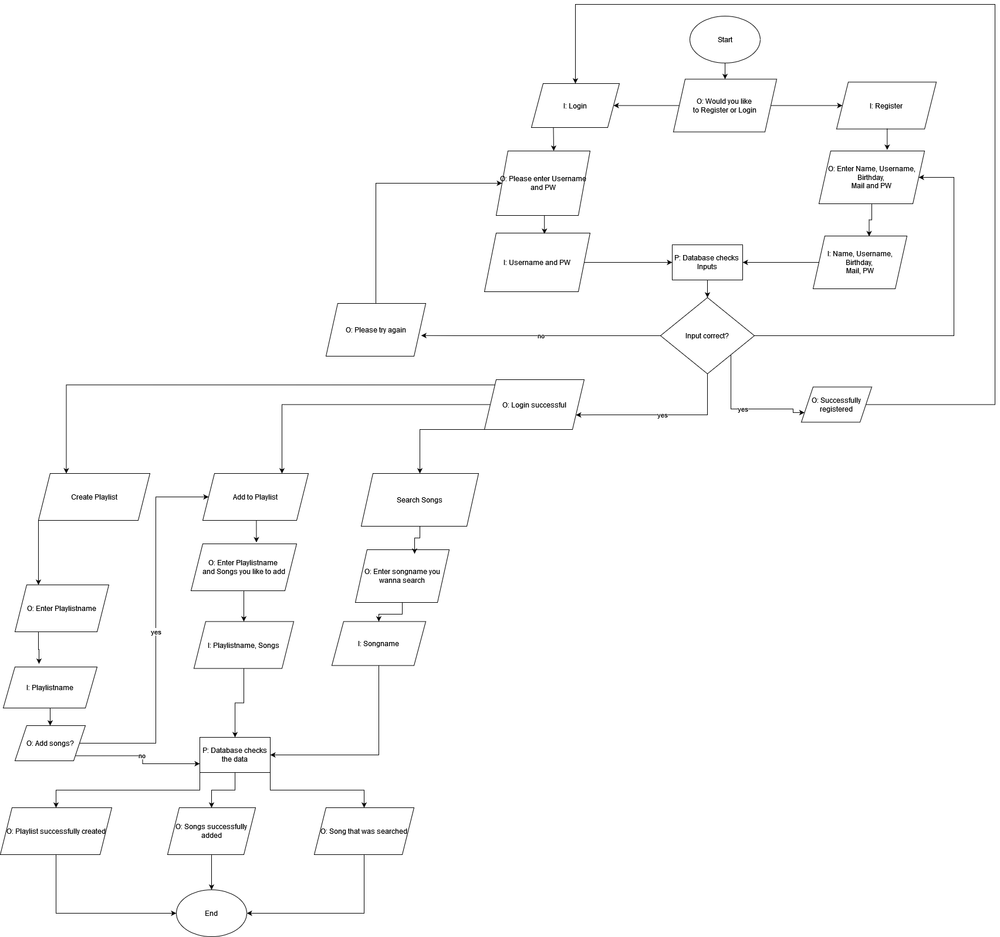

Beschreibung:

Zuerst kann der User entscheiden, ob er sich einloggen will oder sich zuerst noch registrieren muss. Falls er sich registrieren muss, gibt er Name, Username, Passwort, Mail und seinen Geburtstag an, diese werden dann von der Datenbank validiert. Falls das Registrieren erfolgreich war, kann er sich einloggen. Wenn etwas nicht akzeptiert wird, muss der Registrierungsvorgang wiederholt werden. Beim Login muss der User Name und Passwort eingeben, diese werden dann validiert. Sind diese korrekt kommt er in Keep The Beat rein. Wenn etwas falsch war, muss er es erneut versuchen. Im Programm dann kann der User Playlists erstellen, Songs zu Playlists hinzufügen oder nach Songs suchen. Wählt er die Option Playlist erstellen, muss er einen Playlistname angeben, zudem wird er gefragt, ob er Songs hinzufügen will. Wenn nicht wird alles validiert und eine leere Playlist erstellt. Wenn ja kommt er zur Option Songs hinzufügen. Bei dieser Option muss er einen Playlistname und die Songs, die er hinzufügen will, angeben. Dann wird alles validiert und die Songs hinzugefügt. Bei der Option Songs suchen, muss der User einfach denn Song Name angeben und dieser wird dann validiert und gesucht.
### Mockup
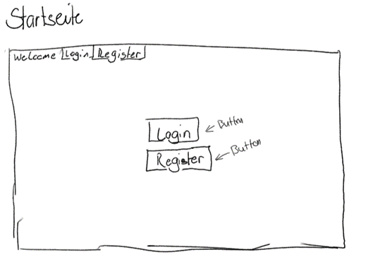

Auf diesem Bild sieht man die Startseite unserer Applikation. Dabei gibt es einen Login Button, falls man schon einen Account hat und einen Register Button um sich zu registrieren, wenn man noch keinen Account hat. 

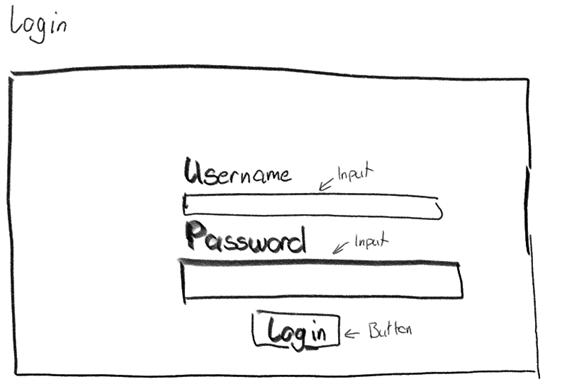

Wenn man auf den Login Button drückt, kommt man auf diese Seite. Hier muss man seinen Nutzernamen und sein Passwort eingeben, damit man sich in seinen Account einloggen kann. Wenn man die Felder ausgefühlt hat, drückt man auf den Login Button, der einen zu der Homepage führt 

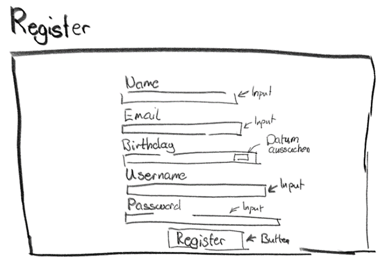

Wenn man auf den Register Button drückt, kommt man auf die Registrierungsseite. Hier muss man seinen Namen, seine E-Mail, seines Geburtstags, sein Benutzernamen und sein Passwort. Wenn man alle Felder ausgefüllt hat, kann man auf Registrieren drücken. Danach wird man automatisch weitergeleitet auf die Login Seite, um sich einzuloggen.  

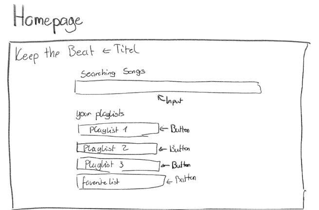

Dies ist die Homepage. Man hat hier eine Übersicht über alle vorhandenen Playlists. Es gibt eine Suchleiste, wo man Liedern suchen kann und man den Titel des Lieds eingeben kann. 

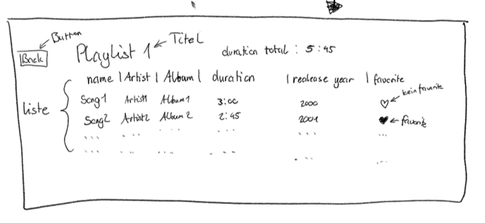

Wenn man auf einen Playlistnamen auf der Homepage drückt, dann kommt man auf diese Ansicht. Hier zeigt es den gegebenen Namen der Playlist an, sowie auch alle Lieder, die Künstler der Lieder, die Dauer, wann es veröffentlicht worden ist, ob es in der Favoriten liste ist und welchem Album das Lied gehört. Ausserdem zeigt es die gesamte Dauer der Playlist an und es hat einen Zurück Button. 

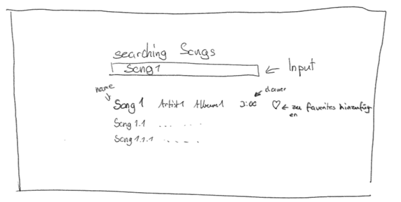

Wenn man ein Lied sucht, kommen dann die Vorschläge. Bei allen ausgegeben Lieder zeigt es, wie schon bei der Playlist, der Name des Lieds, die Dauer, der Künstler, ob es zu den Favoriten gehört und welchem Album es angehört. 

## Prototyping
Prototyp:

Wir haben im Moment eine Willkommens Seite, bei der man sich zwischen Login und Registrieren entscheiden kann. Sowie der jeweilige Login und Registrierseiten. Und auch eine Datenbank.

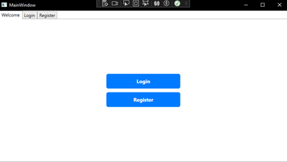

Bei Login kann man den Benutzernamen und Passwort eingeben. Das ist aber noch nicht mit der Datenbank verbunden.

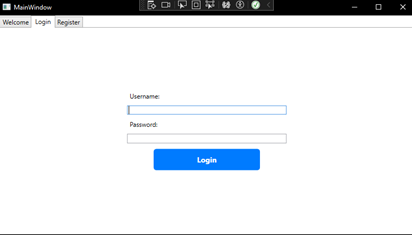

Auf der Register Seite kann man der Name, E-Mail, Geburtstag, Benutzername und Passwort festlegen. Im Moment ist das noch nicht mit der Datenbank verbunden, aber man müsste eigentlich nur noch die Daten an eine Methode übergeben.

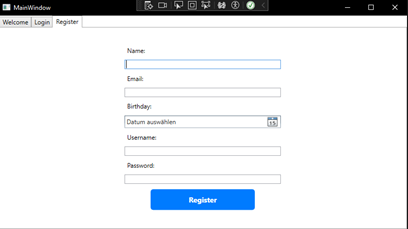

Bei der Datenbank haben wir ein Skript, welches die Datenbank und alle Tabellen erstellt.
Das Skript wir immer beim Öffnen des Programms ausgeführt und prüft auch ob die Datenbank schon vorhanden ist oder nicht. 

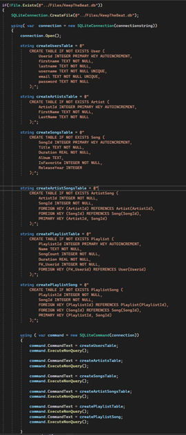

Es hat auch Methoden um einen neuen Benutzer der Datenbank hinzuzufügen.

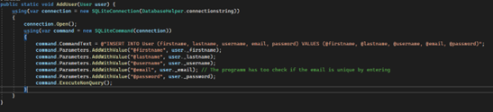

Das Programm hat auch schon Datenbank Funktionen zum hinzufügen von Songs und Künstlern

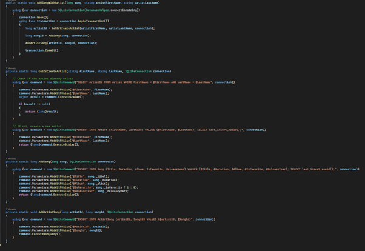

## Implementation
### Klassendiagramm
<!--![Ein Bild, das Text, Screenshot, Schrift, Design enthält.-->

## Testing
Wir habe uns dafür entschieden bei unserer Registrationssete die Validierung der eingaben zu Testen. Für das haben wir 8 Unit Test geschrieben welche alle Möglichkeiten von Usereingaben Testen.

Der erste Test-Case Prüft, ob die Validate Funktion True zurückgibt, wenn alle Eingaben korrekt sind.

<!--![Ein Bild, das Text, Screenshot, Software enthält.-->

Der nächste Test-Case prüft, ob die Validate Funktion False zurückgibt, wenn ein Feld Leer gelassen wird. Wir testen das mit dem Firstname. 

<!--![Ein Bild, das Text, Screenshot, Software enthält.-->

Dann haben wir 2 Test-Cases, die überprüfen, ob die Validierung der E-Mail korrekt ist. Also ob die E-Mail im richtigen Format mit @ ist.  

<!--![Ein Bild, das Text, Screenshot, Software enthält.-->

Dann müssen wir noch einen Testcase haben der die Validate funktion prüft ob die E-Mail nicht schon verwendet wurde. Für das Verwenden wir ein mockUserService und nicht unser echten Service.

<!--![Ein Bild, das Text, Screenshot, Software enthält.-->

Das gleiche müssen wir auch für die Validate funktion machen welche prüft ob der Username nicht schon verwendet wird.

<!--![Ein Bild, das Text, Screenshot, Software enthält.-->

Am Schluss müssen wir noch die Validate funktionen des Passwortes Testen. Das machen wir mit 2 Test-Cases. In einem ist das Passwort zu kurz im anderen ist es Lang genug.

<!--![Ein Bild, das Text, Screenshot, Software enthält.-->

All diese Test sind erfolgreich wenn man sie Ausführt.

<!--![Ein Bild, das Text, Screenshot, Software enthält.-->

## Architektur und Design
<!--![Ein Bild, das Text, Screenshot, Schrift, Design enthält.-->

Hier ist die Startseite von unserer Applikation. Wie man hier sieht, ist der Hintergrund Blau und die Schriftfarbe wurde zu Violet geändert. Ausserdem gibt es zwei Button, mit denen man entweder auf die Login Seite oder auf die Registrierungsseite kommt. 

<!--![Ein Bild, das Text, Screenshot, Reihe, Schrift enthält.-->

Das ist die Registrierungsseite, bei der der Hintergrund auch blau ist und die Labels haben eine andere Farbe als der Titel, damit man diese besser erkennen kann. 

<!--![Ein Bild, das Text, Screenshot, Reihe, Schrift enthält.-->

Wenn man sich registriert hat, kommt man auf die Loginseite, die im gleichen Konzept gestaltet worden ist, wie die vorherigen Seiten

<!--![Ein Bild, das Text, Screenshot, Schrift, Zahl enthält.-->

Das ist die Homepage. Hier werden alle erstellten Playlists angezeigt. Ausserdem gibt es ein Menu, wo man einen Song hochladen, eine Playlist erstellen, ein Feedback geben und sich ausloggen kann. Es beinhaltet eine Suchleiste, mit der man nach Songtitel suchen kann. 

<!--![Ein Bild, das Screenshot, Text, Schrift, Reihe enthält.-->

So sieht es aus, wenn man in eine Playlist reingeht. Es wird angezeigt, wie viele Lieder die Playlist beinhaltet, wie lange sie insgesamt dauert und man kann die Lieder entweder abspielen oder löschen. Ausserdem gibt es einen Button, mit dem man zurück auf die Homepage kommt. 

<!--![Ein Bild, das Text, Screenshot, Reihe, Schrift enthält.-->

Wenn man beim Menu auf «Upload a Song» drückt, kommt man auf diese Seite. Hier wählt man eine Songdatei aus und schreibt den Titel, den Künstler, das Album, das Erscheinungsjahr und ob das Lied ein Favorit ist, aus. Wenn man auf den Upload Button drückt, fügt man das Lied hinzu. 

<!--![Ein Bild, das Text, Software, Zahl, Screenshot enthält.-->

Wenn man auf «Neue Playlist Erstellen» drückt, erscheint dieses Pop-up. Hier gibt man den Namen der Playlist ein, welche dann erstellt wird, wenn man auf den Create Button drückt 

<!--![Ein Bild, das Text, Screenshot, Schrift, Zahl enthält.-->

Wenn man auf «Feedback» klickt, erscheint dieses Pop-up, wobei man sein Feedback hineinschreiben kann und es mit dem Send Button abschicken kann. 

## Projektpräsentation
## Fazit
Dieses Projekt hat uns sehr viel Zeit und Mühe gekostet. Dennoch sind wir sehr zufrieden mit dem Ergebnis. Wir konnte unsere Projektidee umsetzen und sind stolz auf unsere Leistung. Wir hatten allerdings sehr viele Probleme am Anfang, vor allem wegen der Datenbank. Diese wollte sich nicht verbinden lassen mit unserem Projekt und wir haben sehr viel Zeit gebraucht, diese Probleme zu beheben. Dadurch kamen wir in einen Zeitstress, vor allem am Ende des Projekts, da wir es unterschätzt haben. Auch die Dokumentation haben wir ein bisschen vernachlässigt und mussten somit noch sehr viel am Ende machen. Allerdings haben wir uns die Aufgaben sehr gut aufgeteilt und generell haben wir gut miteinander zusammengearbeitet. Im Grossen und Ganzem würden wir uns mehr an unsere Planung halten, um Zeitstress zu verhindern, und würden früher mit der Dokumentation beginnen. 

Version #9

Erstellt: 21 Februar 2024 14:10 von Ana Nikolic

Zuletzt aktualisiert: 14 Juni 2024 19:23 von Ana Nikolic 